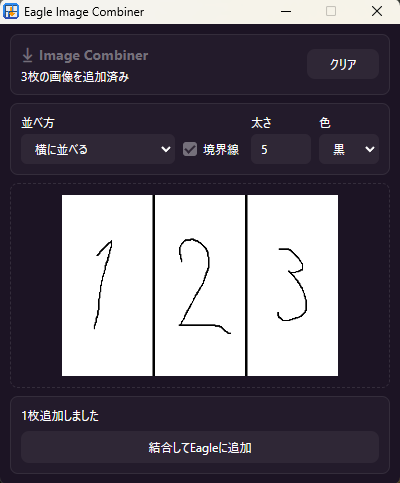

# Eagle Image Combiner: Eagle用画像結合プラグイン

ドラッグ＆ドロップまたはクリップボードから貼り付けた画像を結合し、Eagleへ追加するためのプラグインです。



## できること

- 複数の画像をドラッグ＆ドロップで読み込み
- ブラウザなどでコピーした画像を `Ctrl+V`（macOSでは `⌘V`）で貼り付け
- 画像を横並び、縦並び、2列並びで結合
- 境界線の有無、太さ、黒/白を指定
- 先頭画像名をもとにEagle内アイテムを検索
- 見つかった場合、URL・注釈・所属フォルダを結合画像へ引き継ぎ
- 結合画像をJPEGとしてEagleへ追加

## 使い方

1. Eagleでこのプラグインを起動します。
2. 次のいずれかの方法で画像を追加します。
   - ドロップエリアへ画像ファイルをドラッグ＆ドロップ
   - ブラウザなどで画像をコピーし、プラグイン上で `Ctrl+V`（macOSでは `⌘V`）を押して貼り付け
3. 並べ方、境界線、太さ、色を調整します。
4. `結合してEagleに追加` を押します。

## 補足

- 結合順はドロップした順番です。
- 貼り付けた画像は、貼り付けた順番で末尾に追加されます。
- 透過画像は白背景に合成されます。
- Eagleへの追加にはEagle Plugin APIを使用します。

## 開発

このリポジトリをEagleのプラグインとして読み込んで使用します。

```text
eagle-image-combiner-plugin/
├─ manifest.json
├─ index.html
├─ styles.css
├─ js/
│  └─ app.js
├─ logo.png
└─ screenshot.png
```
